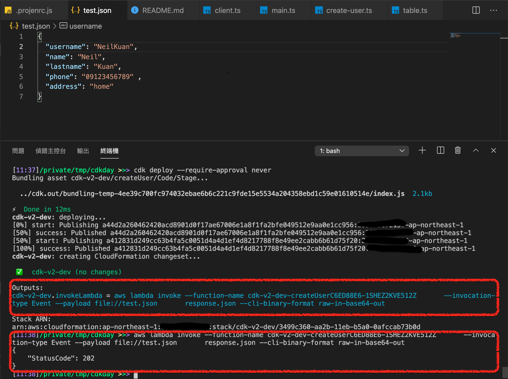
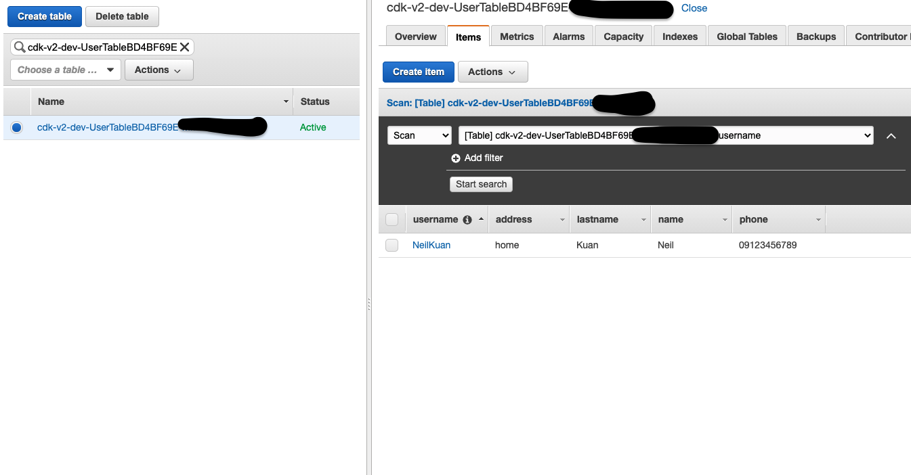

## Sample Code from [2021 CDK DAY](https://youtu.be/5p2QfolwP7U?t=11001)
## Clone Repo
```bash
git clone https://github.com/neilkuan/cdkday.git
```

## Install
```bash
yarn
```

## To diff
```bash
cdk diff
```

## To deploy
```bash
cdk deploy
```


## Invoke Lambda to create user.


## See DymanoDB



## To destroy
```bash
cdk destroy
```
